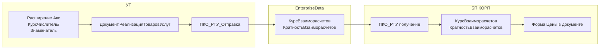

# План доработки: передача переменного курса РТУ из УТ в БП КОРП

**Заказчик:** Техпром  
**Дата:** 22.06.2026  
**Статус:** оценка / готов к реализации  
**Обмен:** односторонний УТ → БП КОРП, план `СинхронизацияДанныхЧерезУниверсальныйФормат` (EnterpriseData, КД 3.0)

---

## 1. Цель

Передавать **переменный курс валюты** из расширения `Акс_ИзменениеКурсаВалют_` (УТ) в поле **«Реализовать по курсу USD»** формы **«Цены в документе»** (БП КОРП) при типовом обмене EnterpriseData.

**Объём:** только документ **«Реализация товаров и услуг»** (`Документ.РеализацияТоваровУслуг`).

---

## 2. Вывод по реализуемости

**Реализуемо, средняя сложность.**

Отдельный канал обмена и расширение XSD-схемы EnterpriseData **в базовом сценарии не требуются**. Поля `КурсВзаиморасчетов` / `КратностьВзаиморасчетов` уже есть в формате и на стороне БП маппятся в штатные реквизиты документа.

**Корневая причина расхождения** — логика выгрузки на УТ: для валютных РТУ (USD, не рубль) типовой ПКО подставляет курс из регистра `ОтносительныеКурсыВалют.СрезПоследних` на дату документа, **игнорируя** `КурсЧислитель` / `КурсЗнаменатель` из шапки (куда попадает значение с формы «Валюты и курс документа»).



---

## 3. Соответствие полей

| Сторона | Форма / поле UI | Реквизиты ИБ | EnterpriseData |
|---------|-----------------|--------------|----------------|
| **УТ** | «Валюты и курс документа» → «Реализовать по курсу USD =» | `КурсЧислитель`, `КурсЗнаменатель` | `КурсВзаиморасчетов`, `КратностьВзаиморасчетов` (при определённых условиях валюты) |
| **БП КОРП** | «Цены в документе» → «Реализовать по курсу USD =» | `КурсВзаиморасчетов`, `КратностьВзаиморасчетов` | Штатный ПКО `Документ_РеализацияТоваровУслуг` |

**Допущение:** расширение `Акс_ИзменениеКурсаВалют_.cfe` пишет переменный курс в типовые `КурсЧислитель` / `КурсЗнаменатель`. Требует верификации на старте работ (+2–4 ч).

---

## 4. Соответствие методике ИТС

Источник: [Расширение формата обмена EnterpriseData](https://its.1c.ru/db/metod8dev/content/6013/hdoc) (ИТС, metod8dev 6013).

| Ситуация | Механизм по ИТС | Для задачи |
|----------|-----------------|------------|
| Новое свойство отсутствует в базовом EnterpriseData | Расширяющий XDTO-пакет + `ПриПолученииДоступныхРасширенийФормата` + ПКО с `ПространствоИмен` | **Не требуется** |
| Свойство есть, но алгоритм выгрузки подставляет неверное значение | Доработка ПКО / `ПриОтправкеДанных` (в т.ч. `&После` в CFE) | **Основной путь** |

### Выбор подхода

| | **Путь A (рекомендуемый)** | **Путь B (резерв)** |
|---|---------------------------|---------------------|
| Суть | CFE на УТ: `&После` `ПКО_РТУ_Отправка_ПриОтправкеДанных` | Расширяющий XDTO + идентичный CFE на УТ и БП |
| БП | Штатный ПКО | Обязательно тот же CFE/XDTO на приёмнике |
| XDTO на поддержке | Да | Нет (сопровождение при обновлениях ED) |
| Смета | **32–40 н/ч** | **44–60 н/ч** |

**Рекомендация:** Путь A — минимальное вмешательство, соответствует духу ИТС 6013.

---

## 5. Решение (Путь A)

### 5.1. УТ — основная доработка

Создать CFE обмена (отдельный или блок в расширении Техпром):

1. Заимствовать `ОбщийМодуль.МенеджерОбменаЧерезУниверсальныйФормат`.
2. Добавить `&После` → `ПКО_Документ_РеализацияТоваровУслуг_Отправка_ПриОтправкеДанных`.

**Логика перехвата** — после типовой выгрузки записать в `ДанныеXDTO`:

```bsl
ДанныеXDTO.КурсВзаиморасчетов      = ДанныеИБ.КурсЧислитель;
ДанныеXDTO.КратностьВзаиморасчетов = ДанныеИБ.КурсЗнаменатель;
```

**Условие применения** (согласовать с заказчиком):

- валюта документа ≠ рубль, **и**
- в шапке заполнен документный курс («переменный»), **или** курс отличается от курса ЦБ на дату.

**Не менять:** типовой пакет `EnterpriseData_*`, `ПриПолученииДоступныхРасширенийФормата`.

**Точка в типовом коде УТ:**  
`src/cf/CommonModules/МенеджерОбменаЧерезУниверсальныйФормат/Ext/Module.bsl` — процедуры `ДобавитьПКО_Документ_РеализацияТоваровУслуг_Отправка`, `ПКО_Документ_РеализацияТоваровУслуг_Отправка_ПриОтправкеДанных` (критический фрагмент ~стр. 33175–33201: подстановка из `ОтносительныеКурсыВалют`).

### 5.2. БП КОРП — ожидаемо без доработки

Штатный ПКО `Документ_РеализацияТоваровУслуг` в `МенеджерОбменаЧерезУниверсальныйФормат13` принимает `КурсВзаиморасчетов` / `КратностьВзаиморасчетов`.

**Резерв:** CFE БП с `&После` обработчика записи ПКО, если при записи/проведении курс перезаписывается (+4–8 ч).

### 5.3. Вне scope

- Заказы, корректировки, комиссионная ветка `РеализацияТоваровУслугКомиссия_Отправка` — только по отдельному согласованию после тестов.

---

## 6. Этапы работ

| № | Этап | Часы | Результат |
|---|------|------|-----------|
| 1 | Разбор CFE `Акс_ИзменениеКурсаВалют_`, подтверждение полей хранения курса | 4–6 | Отчёт: откуда читать курс в ПКО |
| 2 | Фиксация подхода по ИТС 6013 (Путь A vs B) в ТЗ | 1–2 | Согласованное бизнес-правило подстановки |
| 3 | Согласование условия: всегда документный курс vs только при отличии от ЦБ | 2–3 | Утверждённое правило |
| 4 | Разработка CFE УТ (`&После` ПКО отправки РТУ) | 8–12 | CFE в `src/cfe/` |
| 5 | Анализ приёма БП + резервное CFE БП при необходимости | 2–8 | Подтверждение / доработка приёмника |
| 6 | Функциональное тестирование УТ→БП | 8–12 | Протокол тестов |
| 7 | Внедрение на контур Техпром, инструкция для бухгалтерии | 2–4 | CFE загружен, инструкция |
| | **Рекомендуемая смета (Путь A)** | **32–40** | |
| | Резерв: Путь B (XDTO, УТ+БП) | +12–20 | Только при неудаче Пути A |

### Сценарии по вероятности

- **Оптимистично (24–28 ч):** курс в `КурсЧислитель`/`КурсЗнаменатель`; `&После` на отправке; БП без доработок.
- **Базовый (32–40 ч):** полный регресс валютных РТУ, документация, согласование правил.
- **Пессимистично (44–56 ч):** курс в отдельном реквизите/регистре; доработки БП; проблемы повторной выгрузки.

---

## 7. Критерии приёмки

1. РТУ в USD с курсом **73,8838** (переменный) в сообщении обмена содержит `КурсВзаиморасчетов` = 73,8838 (кратность 1).
2. После загрузки в БП в форме «Цены в документе» поле «Реализовать по курсу USD» = **73,8838**.
3. Рублёвые РТУ и РТУ с курсом ЦБ — поведение **не ухудшилось**.
4. Повторная выгрузка документа обновляет курс в БП при изменении в УТ.

---

## 8. Риски

| Риск | Влияние | Митигация |
|------|---------|-----------|
| CFE Акс хранит курс не в `КурсЧислитель`/`КурсЗнаменатель` | +4–12 ч | Разбор CFE на этапе 1 |
| Пересчёт рублёвых сумм и проводок в БП | Ошибки учёта | Сверка с бухгалтерией в тестах |
| Повторный обмен не обновляет курс в БП | Расхождение после правки в УТ | Тест «изменили курс → повторная выгрузка» |
| Несовместимость версий EnterpriseData (1.17–1.22) | Сбой обмена | Проверить версию на контуре Техпром |
| Два CFE (Акс + обмен) — порядок, SafeMode | Конфликт при загрузке | Проверить при внедрении |
| Выбор Пути B (XDTO) | +12–20 ч, сопровождение XSD | Только если Путь A не проходит тесты |

---

## 9. Чеклист реализации

- [ ] Разобрать `Акс_ИзменениеКурсаВалют_.cfe` (`extensions_decompile` / конфигуратор)
- [ ] Зафиксировать Путь A в ТЗ, согласовать условие подстановки курса
- [ ] Создать CFE: заимствовать `МенеджерОбменаЧерезУниверсальныйФормат`, `&После` `ПКО_Документ_РеализацияТоваровУслуг_Отправка_ПриОтправкеДанных`
- [ ] Обработать краевые случаи: пустой курс, кратность = 0, рублёвые документы
- [ ] `syntaxcheck` / `check_1c_code` по модулю расширения
- [ ] Тест: новый USD РТУ с переменным курсом → выгрузка → загрузка в БП
- [ ] Тест: регресс рублёвых и курс ЦБ
- [ ] Тест: повторная выгрузка после изменения курса
- [ ] При необходимости: CFE БП (`&После` при записи) или переход на Путь B
- [ ] Загрузка CFE на контур Техпром, инструкция для пользователей

---

## 10. Глоссарий

| Термин | Расшифровка | В контексте задачи |
|--------|-------------|-------------------|
| **ПКО** | **Правило конвертации объекта** — описывает преобразование одного объекта метаданных при обмене (маппинг полей, обработчики событий) | `ПКО_Документ_РеализацияТоваровУслуг_Отправка` — выгрузка РТУ из УТ; `ПКО_Документ_РеализацияТоваровУслуг` — загрузка РТУ в БП |
| **ПОД** | **Правило обработки данных** — определяет, какие объекты ИБ попадают в обмен и в каком порядке обрабатываются | Для РТУ уже настроено типово; в доработке не меняется |
| **ПКС** | **Правило конвертации свойств** — соответствие одного поля ИБ одному свойству XDTO внутри ПКО | Например: `КурсЧислитель` → `КурсВзаиморасчетов` |
| **EnterpriseData** | Универсальный формат обмена данными 1С (XML/XDTO), версии 1.17–1.22 и др. | Транспорт полей `КурсВзаиморасчетов`, `КратностьВзаиморасчетов` между УТ и БП |
| **XDTO** | Типизированное XML-представление данных по XSD-схеме; пакеты `EnterpriseData_*`, `ExchangeMessage` | Структура `ДанныеXDTO` в обработчиках ПКО |
| **КД 3.0** | **Конвертация данных**, редакция 3.0 — подсистема БСП для настройки правил обмена (ПОД, ПКО) | Правила лежат в `МенеджерОбменаЧерезУниверсальныйФормат` |
| **РТУ** | **Реализация товаров и услуг** — `Документ.РеализацияТоваровУслуг` | Единственный документ в scope доработки |
| **УТ** | **1С:Управление торговлей** — источник обмена | Откуда выгружается переменный курс |
| **БП / БП КОРП** | **1С:Бухгалтерия предприятия КОРП** — приёмник обмена | Куда должен попасть курс в форму «Цены в документе» |
| **CFE** | **Расширение конфигурации** (файл `.cfe`) | Планируется CFE на УТ с перехватом ПКО; расширение `Акс_ИзменениеКурсаВалют_` уже установлено |
| **ДанныеИБ** | Данные объекта в информационной базе (структура/выборка при выгрузке) | Источник: `КурсЧислитель`, `КурсЗнаменатель` |
| **ДанныеXDTO** | Данные в формате обмена (структура XDTO перед записью в сообщение) | Цель доработки: подставить документный курс в `КурсВзаиморасчетов` |
| **ПриОтправкеДанных** | Обработчик ПКО отправки: последняя точка правки данных перед выгрузкой в XDTO | Перехватывается через `&После` в CFE |
| **Расширение формата** | Дополнение XSD-схемы EnterpriseData новыми свойствами/объектами (по ИТС 6013) | **Путь B** — не нужен в базовом сценарии, т.к. поля курса уже есть в формате |
| **Расширение конфигурации** | CFE с заимствованными объектами и перехватами (`&Перед`, `&После`) | **Путь A** — основной способ доработки без изменения XSD |
| **&После** | Директива расширения: код выполняется после типовой процедуры | Используется для подстановки курса после типовой логики ПКО |
| **SafeMode** | Безопасный режим расширения — ограничение опасных вызовов | Проверить совместимость двух CFE (Акс + обмен) при внедрении |
| **План обмена** | `СинхронизацияДанныхЧерезУниверсальныйФормат` — регистрация объектов и настройка синхронизации | Канал УТ → БП КОРП, вариант «Бухгалтерия предприятия» |

---

## 11. Источники

- ИТС: [Расширение формата обмена EnterpriseData](https://its.1c.ru/db/metod8dev/content/6013/hdoc)
- БСП: `ОбменДаннымиПереопределяемый.ПриПолученииДоступныхРасширенийФормата`
- УТ: `src/cf/CommonModules/МенеджерОбменаЧерезУниверсальныйФормат/Ext/Module.bsl`
- УТ: `src/cf/CommonModules/ОбменДаннымиXDTOСервер/Ext/Module.bsl`
- УТ: `src/cf/Documents/РеализацияТоваровУслуг.xml`
- БП: `МенеджерОбменаЧерезУниверсальныйФормат13`, реквизиты `КурсВзаиморасчетов` / `КратностьВзаиморасчетов` у `Документ.РеализацияТоваровУслуг`
